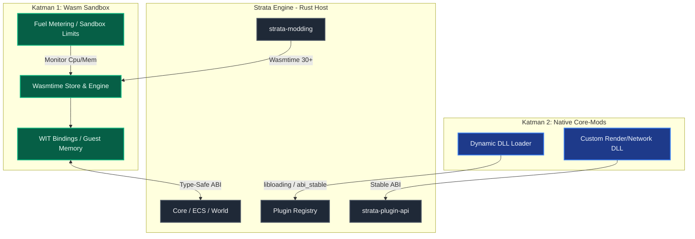

# Strata Faz 5 Uygulama Planı — Modlama Sistemi & Plugin Mimarisi

**Süre:** Hafta 19-24 (6 Hafta)  
**Hedef:** Wasmtime 30+ & WIT tabanlı güvenli, yüksek performanslı sandbox modlama altyapısı, hot-reload desteği, plugin-first motor refaktörü ve native dynamic link library (.dll) mod yükleyici.

---

## 1. Mimari Genel Bakış & Entegrasyon Modeli

Strata'nın modlama ve genişletilebilirlik sistemi iki temel katmandan oluşmaktadır:
1. **Katman 1 (Güvenli Wasm Modları):** Wasmtime 30+ kullanan, WIT (WebAssembly Interface Types) ile sınırları belirlenmiş, yakıt sınırlamalı (fuel metering) ve tamamen izole (sandboxed) çalışan modlama katmanı. Bu katman oyun içi mantık, blok tanımlamaları, özel eşyalar ve basit yapay zeka sistemleri için optimize edilmiştir.
2. **Katman 2 (Native Core-Modlar):** `libloading` veya `abi_stable` kullanarak doğrudan motorun bellek alanına yüklenen `.dll` kütüphaneleri. Bu katman render pipeline, fizik motoru ve network protokolü gibi kritik sistemleri değiştirmek isteyen derin modlar için tasarlanmıştır.

### Mimari Bileşenler (Mermaid)



---

## 2. Haftalık Çalışma Takvimi (Hafta 19-24)

### Hafta 19 — Crate Yapısı & WIT Interface Tanımları
- **Hedef:** `strata-plugin-api` ve `strata-modding` crate iskeletlerinin kurulması, WIT dosyalarının optimize edilmesi.
- **İş Listesi:**
  - `crates/plugin-api` ve `crates/modding` dizinlerinin ve `Cargo.toml` dosyalarının oluşturulması.
  - WIT (WebAssembly Interface Types) şemalarının (`block_api.wit`, `entity_api.wit`, `event_api.wit`) optimize edilerek yazılması.
  - Rust component bindings üretimi için `wit-bindgen` veya `wasmtime::component::bindgen!` makro konfigürasyonu.

### Hafta 20 — Wasmtime Runtime & Sandbox Yapılandırması
- **Hedef:** Wasmtime 30+ entegrasyonu, güvenli bellek limitleri, fuel metering (yakıt tüketimi) sistemi ve asenkron yürütme altyapısı.
- **İş Listesi:**
  - Wasmtime Engine, Linker ve Store konfigürasyonlarının yapılması.
  - CPU sonsuz döngülerini engellemek için `consume_fuel` (yakıt sayacı) entegrasyonu.
  - Mod başına maksimum 64MB linear bellek limiti getirilmesi.
  - Host-Guest arası sıfır kopyalama (zero-copy) ve opaque handle (`u32` ID'leri) sisteminin kurulması.

### Hafta 21 — Wasm Mod Yükleyici & Hot-Reload Mekanizması
- **Hedef:** Diskten dinamik Wasm modlarının yüklenmesi, ECS dünya state'ini kaybetmeden hot-reload mekanizmasının kurulması.
- **İş Listesi:**
  - Mod manifest dosyası (TOML formatında metadata) parse işlemlerinin yazılması.
  - Wasm modlarının asenkron yüklenmesi ve ECS sistemleriyle senkronize çalışması.
  - `notify` crate'i ile dosya sistemi izlenerek `.wasm` dosyaları değiştiğinde otomatik hot-reload tetiklenmesi.
  - ECS tabanlı durum koruma: Mod durumunun Bevy ECS içinde host tarafında tutulması, mod değiştiğinde mantığın değişip verinin korunması.

### Hafta 22 — Plugin API Refaktörü
- **Hedef:** Strata'nın monolitik yapısının tamamen dağıtılması ve tüm ana sistemlerin (`render`, `lighting`, `physics`, `world-gen`, `network`) birer plugin haline getirilmesi.
- **İş Listesi:**
  - `GamePlugin` trait'inin tanımlanması (on_register, on_startup, on_shutdown ve event hook'ları).
  - `PluginRegistry` mimarisinin kurulması (bağımlılık sıralama, DAG tabanlı plugin yükleme sırası).
  - Mevcut sistemlerin bu API'ye entegre edilerek `bin/client` ve `bin/server` içerisinde dinamik olarak yüklenmesi.

### Hafta 23 — Native Core-Mod (.dll) Yükleyici
- **Hedef:** `libloading` kullanarak dinamik Rust/C kütüphanelerinin güvenli ve optimize bir şekilde yüklenmesi.
- **İş Listesi:**
  - `.dll` dynamic link loader modülünün geliştirilmesi.
  - Native modlar için ABI uyumluluk kontrolü (Rust compiler sürümü ve mimari doğrulama).
  - Native modların `PluginRegistry` sistemine kendilerini kaydedebilmesi için entry-point tanımlanması.
  - Native modlar yüklenirken kullanıcıya güvenlik uyarısı gösterilmesi.

### Hafta 24 — Entegrasyon, Optimizasyon & Performans Testleri
- **Hedef:** Wasm sandboxing overhead'inin minimize edilmesi, stress testleri, WIT interop benchmark'ları ve hata ayıklama arayüzleri.
- **İş Listesi:**
  - WIT interop çağrılarında bellek kopyalamalarının azaltılması (profiling ile optimizasyon).
  - 100+ Wasm modu çalışırken bellek ve CPU overhead ölçümleri.
  - WIT API test suite oluşturularak sınır koşulların doğrulanması.
  - Faz 5 sonu kriterlerinin test edilip `dev` branch'ine merge edilmesi.

---

## 3. Detaylı Teknik Tasarım & Kod Şablonları

### 3.1. WIT (WebAssembly Interface Types) Tanımı
Wasm modları ile Strata motoru arasındaki iletişimin type-safe ve hızlı olması için **WIT Component Model** kullanılacaktır.

**Dosya:** `crates/modding/wit/strata_api.wit`
```wit
package strata:engine-api;

interface block-registry {
    record block-properties {
        name: string,
        hardness: f32,
        blast-resistance: f32,
        transparent: bool,
        light-emission: u8,
    }

    register-block: func(properties: block-properties) -> u16;
    get-block-name: func(id: u16) -> string;
}

interface event-hooks {
    on-block-placed: func(x: i32, y: i32, z: i32, block-id: u16);
    on-block-broken: func(x: i32, y: i32, z: i32, block-id: u16);
    on-player-tick: func(player-id: u64, x: f32, y: f32, z: f32);
}

world strata-mod {
    import block-registry;
    export event-hooks;
}
```

### 3.2. Wasmtime Sandboxing & Fuel Config
Wasm modlarının motora zarar vermesini önlemek için CPU yakıtı (fuel) ve limitli bellek havuzları kullanılacaktır.

**Dosya:** `crates/modding/src/sandbox.rs`
```rust
use wasmtime::{Config, Engine, ResourceLimiter, Store};

pub struct SandboxLimits {
    pub max_memory: usize,
    pub max_table_elements: u32,
}

impl ResourceLimiter for SandboxLimits {
    fn memory_growing(&mut self, current: usize, desired: usize, _maximum: Option<usize>) -> anyhow::Result<bool> {
        if desired > self.max_memory {
            tracing::warn!("Wasm Mod bellek limitini aştı! Mevcut: {}, İstenen: {}, Sınır: {}", current, desired, self.max_memory);
            return Ok(false);
        }
        Ok(true)
    }

    fn table_growing(&mut self, _current: u32, desired: u32, _maximum: Option<u32>) -> anyhow::Result<bool> {
        if desired > self.max_table_elements {
            return Ok(false);
        }
        Ok(true)
    }
}

pub fn create_wasm_engine() -> Engine {
    let mut config = Config::new();
    config.wasm_component_model(true);
    config.consume_fuel(true); // CPU sonsuz döngü koruması
    config.epoch_interruption(true); // Asenkron yield / timeout
    
    Engine::new(&config).expect("Wasmtime motoru başlatılamadı")
}
```

### 3.3. Plugin API & Registry Tasarımı
Strata'nın modüler mimarisini sağlayan çekirdek `GamePlugin` tanımı ve Dependency DAG yapısı.

**Dosya:** `crates/plugin-api/src/trait.rs`
```rust
use bevy_ecs::prelude::App;
use semver::Version;

pub trait GamePlugin: Send + Sync {
    /// Plugin'in benzersiz adı (örn: "strata-render")
    fn name(&self) -> &'static str;
    
    /// Semver uyumlu versiyon bilgisi
    fn version(&self) -> Version;
    
    /// Bu plugin çalışmadan önce yüklenmesi gereken bağımlılıklar
    fn dependencies(&self) -> Vec<&'static str> {
        Vec::new()
    }
    
    /// Plugin kayıt edildiğinde tetiklenir (Resource initialization)
    fn on_register(&self, app: &mut App);
    
    /// Motor başlarken tetiklenir (System registration)
    fn on_startup(&self, app: &mut App);
    
    /// Motor kapanırken tetiklenir (State cleanup)
    fn on_shutdown(&self, app: &mut App);
}
```

### 3.4. Native DLL Loader
İleri seviye performans gerektiren modlar için dinamik kütüphane (.dll) yükleyici.

**Dosya:** `crates/plugin-api/src/native_loader.rs`
```rust
use std::path::Path;
use libloading::{Library, Symbol};
use crate::trait::GamePlugin;

pub struct NativePluginLoader {
    loaded_libraries: Vec<Library>,
}

impl NativePluginLoader {
    pub fn new() -> Self {
        Self { loaded_libraries: Vec::new() }
    }

    pub unsafe fn load_plugin<P: AsRef<Path>>(&mut self, path: P) -> anyhow::Result<Box<dyn GamePlugin>> {
        tracing::info!("Native mod yükleniyor: {:?}", path.as_ref());
        
        let lib = Library::new(path.as_ref())?;
        
        // Dynamic library entry point
        let init_fn: Symbol<unsafe extern "C" fn() -> *mut dyn GamePlugin> = lib.get(b"_strata_plugin_create")?;
        let raw_plugin = init_fn();
        
        if raw_plugin.is_null() {
            return Err(anyhow::anyhow!("Plugin oluşturma fonksiyonu null döndürdü"));
        }
        
        let plugin = Box::from_raw(raw_plugin);
        self.loaded_libraries.push(lib);
        
        Ok(plugin)
    }
}
```

---

## 4. Doğrulama & Performans Optimizasyon Planı

### 4.1. Automated Tests (Otomatik Testler)
- **Wasm Sandbox Güvenlik Testi:** Sonsuz döngü içeren bir Wasm modunun (`loop {}`) motoru çökertmediği, yakıt tüketiminin (fuel limit) devreye girip modun durdurulduğu test edilecektir.
- **Bellek Aşımı Testi:** 128MB bellek tahsis etmeye çalışan bir modun `memory_growing` limitine takılıp güvenli bir şekilde sonlandırıldığı doğrulanacaktır.
- **Hot-Reload State Tutarlılık Testi:** Bir mod kaldırılıp tekrar yüklendiğinde, host ECS tarafındaki blok kayıtlarının bozulmadığı doğrulanacaktır.

```bash
# Modding crate testleri
cargo test -p strata-modding

# Plugin API ve loader testleri
cargo test -p strata-plugin-api
```

### 4.2. Performans Benchmark Kriterleri (Criterion)
- **WIT Interop Overhead Benchmark:** Host-Guest arası bir fonksiyona 10.000 kez çağrı yapılması ve mikro saniye cinsinden gecikme (latency) ölçümü. (Hedef: < 0.1 µs/call).
- **Opaque Handle vs Serialization:** Veriyi serialize edip göndermek yerine `u32` opaque handle kullanarak yapılan işlemlerin throughput karşılaştırması.

### 4.3. Manual Verification (Manuel Doğrulama)
- Geliştirici konsolundan `mod load <name>` ve `mod reload <name>` komutlarının dinamik testi.
- Bir modun `.wasm` binary'si derlendiğinde, `notify` fs watcher'ın anında tetiklenip oyun içindeki bloğun rengini veya kırılma hızını anlık değiştirdiğinin (hot-reload) görsel kontrolü.

---

## 5. Riskler ve Mitigasyon Yolları

| Risk Başlığı | Olasılık | Etki | Mitigasyon Planı |
|--------------|----------|------|------------------|
| **Wasm Interop Overhead** | Yüksek | Orta | WIT arayüzünde kompleks struct geçişlerinden kaçınılacak. Veriler host ECS'te kalacak, Wasm tarafına sadece `u32` index/handle aktarılacak. |
| **Rust DLL ABI Uyumsuzluğu** | Yüksek | Yüksek | Rust'ın kararlı bir ABI'si yoktur. Bu sorunu çözmek için native eklentiler compile edilirken aynı compiler toolchain sürümü zorunlu tutulacak veya `abi_stable` crate'i ile stabilize edilecek. |
| **Hot-Reload Bellek Sızıntısı** | Orta | Yüksek | Wasmtime `Store` ve instance'lar dropped edildiğinde bellek tamamen serbest bırakılır. Host tarafında modların oluşturduğu referanslar zayıf pointer (`Weak`) veya `Handle` olarak tutulacak. |
| **Wasmtime Derleme Süresi** | Düşük | Düşük | JIT (Just-In-Time) derleme yerine, modlar yüklenmeden önce pre-compiled `.cwasm` formatına dönüştürülebilecek (AOT compilation). |
