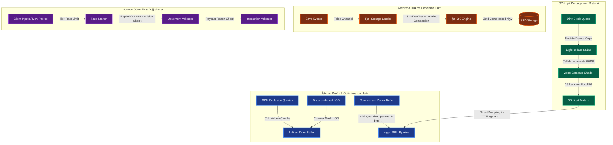

# Strata Faz 6 Uygulama Planı — Optimizasyon, Performans & Polish

**Süre:** Hafta 25-30 (6 Hafta)  
**Hedef:** GPU tabanlı ışık propagasyonu, `fjall 3.0` LSM-tree KV depolama entegrasyonu ve veri migrasyonu, bellek profilleme ve sızıntı tespiti, sunucu taraflı hile önleme (anti-cheat) temelleri, Criterion/Divan benchmark paketleri, 100+ chunk görüş mesafesinde sabit 60+ FPS optimizasyonları ve uzun vadeli GPU-driven rendering için Aokana (SVDAG) mimari araştırması.

---

## 1. Mimari Genel Bakış & Entegrasyon Modeli

Strata'nın son fazı olan **Faz 6**, motorun ham yeteneklerini ekstrem seviyede optimize etmeyi, kararlılığı artırmayı ve geleceğe yönelik araştırma adımlarını tamamlamayı hedefler. Bu fazda, CPU darboğazları GPU'ya kaydırılır, depolama sistemi asenkron ve yüksek throughput'lu LSM-tree yapısına geçirilir ve çoklu oyuncu güvenliği için sunucu otoritesi sıkılaştırılır.

### Mimari Bileşenler ve Optimizasyon Döngüsü (Mermaid)



---

## 2. Haftalık Çalışma Takvimi (Hafta 25-30)

### Hafta 25 — GPU Compute Shader Işık Propagasyonu (Hibrit Mimari)
- **Hedef:** BFS tabanlı CPU ışık hesaplamasını wgpu Compute Shader ile GPU'ya taşımak ve sunucu oyun mantığı için paralel çalışan hafifletilmiş bir CPU katmanı kurmak.
- **İş Listesi:**
  - `crates/lighting` ve `crates/render` entegrasyonu ile GPU tabanlı ışık güncelleme hattını tasarlamak.
  - WGSL dilinde Cellular Automata tabanlı paralel flood-fill propagasyon shader'ını yazmak. Güncellenen verileri doğrudan 3D Light Texture'a aktarmak (GPU-GPU).
  - Sunucu tarafında mob spawn ve tarım gibi oynanış mekaniklerinin çalışması için hafifletilmiş, sadece değişen blokların çevresini güncelleyen asenkron bir CPU BFS modülü geliştirmek.

### Hafta 26 — Fjall 3.0 LSM-Tree Geçişi ve Levelled Compaction
- **Hedef:** Region file tabanlı depolama sistemini `fjall 3.0` LSM-tree yapısına taşımak, Seviyeli (Levelled) Compaction politikasını yapılandırmak.
- **İş Listesi:**
  - `crates/storage/Cargo.toml` içerisine `fjall = "3.0"` entegrasyonu yapmak.
  - **Seviyeli (Levelled) Compaction:** Chunk yükleme hızını (read/load) ve disk alanı verimliliğini maksimize etmek için partition'ı Levelled compaction politikasıyla yapılandırmak.
  - Yoğun yazma (save) anlarında compaction yükünün ana thread'i engellememesi için compaction operasyonlarını dedicated arka plan storage worker thread'lerinde izole etmek.
  - Eski dünyaları asenkron okuyup `fjall` veritabanına aktaran bir migrasyon script'i geliştirmek.

### Hafta 27 — Bellek Profilleme, Sızıntı Tespiti ve Allocator Optimizasyonları
- **Hedef:** İstemci ve sunucuda bellek sızıntılarını sıfırlamak, heap fragmantasyonunu azaltmak ve Tracy/DHAT entegrasyonunu sağlamak.
- **İş Listesi:**
  - Windows platformunda yüksek performanslı heap yönetimi ve minimum fragmantasyon için `mimalloc` crate'ini global allocator olarak tanımlamak.
  - CPU/GPU çağrı sürelerini, thread durumlarını ve bellek tahsisatlarını (allocation hotspots) canlı izlemek için `tracy-client` entegrasyonunu tamamlamak.
  - Bellek sızıntılarını ve gereksiz bellek kopyalamalarını (redundant copies) tespit etmek amacıyla `dhat` crate'i ile profil test senaryoları yazmak.
  - İstemci ve sunucunun 1 saatlik simüle edilmiş oyuncu oturumunda bellek büyüme grafiğini (growth rate) stabil tutmak (<1MB/saat sızıntı sınırı).

### Hafta 28 — Sunucu Otoritesi ve Dinamik Grace Period Anti-Cheat
- **Hedef:** Sunucuda patlama, portal geçişi veya anlık ping artışı gibi durumlarda yalancı hile uyarılarını engelleyen dinamik toleranslı korumaları devreye almak.
- **İş Listesi:**
  - **Dinamik Grace Period:** Knockback (patlama) veya portal geçişi tetiklendiğinde sunucu ilgili oyuncu için geçici tolerans pencereleri (grace period) açar.
  - **Hareket Doğrulayıcı (Movement Validator):** Sürekli hız/uçma ihlali yapan oyuncuları son güvenli noktaya geri çeken (rubberband) durum makinesini kodlamak.
  - **AABB Collision & Reach Checker:** Oyuncuların katı blokların içine girmesini (wallhack) ve maksimum 6 blokluk reach mesafesi ötesi etkileşimleri (line-of-sight raycast) sunucu otoritesinde doğrulamak.

### Hafta 29 — Performans Benchmark Paketi ve %5 Regresyon Eşiği
- **Hedef:** Tüm kritik motor bileşenlerini kapsayan, PR/derlemelerde %5 üzeri performans regresyonlarını bloke eden otomatik benchmark test suite'ini oluşturmak.
- **İş Listesi:**
  - `criterion` ve `divan` benchmark kütüphanelerini workspace bağımlılıklarına eklemek.
  - noise generation, CPU/GPU meshing, light propagation ve db read/write operasyonlarını kapsayan detaylı benchmark senaryoları yazmak.
  - **%5 Regresyon Sınırı:** CI/CD hattında (Github Actions) benchmark testlerini koşturarak, kritik yollarda %5'in üzerindeki yavaşlamalarda build/PR aşamasını otomatik olarak başarısız sayacak (fail) kontrol betiklerini entegre etmek.

### Hafta 30 — Vertex Sıkıştırma, Mesh LOD ve Aokana Araştırması
- **Hedef:** İstemcide 100 chunk görüş mesafesinde sabit 60+ FPS değerini yakalamak ve SVDAG mimari yol haritasını hazırlamak.
- **İş Listesi:**
  - **Quantized Vertex Compression:** Vertex koordinatlarını yerel chunk origin noktasına göre quantize ederek normal, UV ve AO verileriyle birlikte tek bir u64 (8 byte) içine sıkıştırmak.
  - **Mesh LOD (Level of Detail):** Uzaktaki chunk mesh'lerini greedy meshing aşamasında daha büyük voxel gruplarını tek bir quad olarak birleştirerek (coarser mesh) oluşturmak ve GPU yükünü azaltmak.
  - Görüş alanı dışındaki chunk'ları elemek için GPU hiyerarşik occlusion query yapısını entegre etmek.
  - **Aokana (SVDAG) Araştırması:** Sparse Voxel Directed Acyclic Graphs mimarisini inceleyerek statik uzaktaki LOD yapıların VRAM optimizasyon yol haritasını tasarlamak.

---

## 3. Detaylı Teknik Tasarım & Kod Şablonları

### 3.1. GPU Işık Propagasyonu (WGSL Compute Shader)

GPU üzerinde ışığın 3D grid hücrelerinde Cellular Automata mantığıyla yayılması için kullanılacak WGSL compute shader mimarisi.

**Dosya:** `assets/shaders/lighting_propagate.wgsl`
```wgsl
@group(0) @binding(0) var<storage, read_write> block_data: array<u32>;   // Voxel Block IDs (quantized)
@group(0) @binding(1) var<storage, read_write> light_data: array<u32>;   // Packed Light Levels (4-bit sky, 4-bit block)

struct ComputeParams {
    chunk_width: u32,  // 16
    chunk_height: u32, // 256
    chunk_depth: u32,  // 16
    iteration: u32,
}
@group(0) @binding(2) var<uniform> params: ComputeParams;

fn get_index(x: u32, y: u32, z: u32) -> u32 {
    return x + (z * params.chunk_width) + (y * params.chunk_width * params.chunk_depth);
}

// 4-bit Sky ve Block light verisini paketten çıkarma
fn unpack_light(index: u32) -> vec2<u32> {
    let byte_index = index / 2u;
    let packed_byte = light_data[byte_index];
    let is_odd = (index & 1u) == 1u;
    
    var val: u32 = 0u;
    if (is_odd) {
        val = packed_byte >> 4u;
    } else {
        val = packed_byte & 0x0Fu;
    }
    
    // Alt 4 bit = block light, Üst 4 bit = sky light (örnek paketleme)
    let block = val & 0x0Fu;
    let sky = (val >> 4u) & 0x0Fu;
    return vec2<u32>(sky, block);
}

fn pack_light(index: u32, sky: u32, block: u32) {
    let byte_index = index / 2u;
    let is_odd = (index & 1u) == 1u;
    let light_val = (block & 0x0Fu) | ((sky & 0x0Fu) << 4u);
    
    // Atomik işlemler veya ping-pong double buffering ile yarış durumları (race conditions) engellenir
    if (is_odd) {
        light_data[byte_index] = (light_data[byte_index] & 0x0Fu) | (light_val << 4u);
    } else {
        light_data[byte_index] = (light_data[byte_index] & 0xF0u) | light_val;
    }
}

@compute @workgroup_size(4, 8, 4)
fn main(@builtin(global_invocation_id) global_id: vec3<u32>) {
    let x = global_id.x;
    let y = global_id.y;
    let z = global_id.z;
    
    if (x >= params.chunk_width || y >= params.chunk_height || z >= params.chunk_depth) {
        return;
    }
    
    let idx = get_index(x, y, z);
    
    // Mevcut ışık seviyeleri
    let current_light = unpack_light(idx);
    var max_sky = current_light.x;
    var max_block = current_light.y;
    
    // 6 Komşu yönün taranması (Cellular Automata)
    let dirs = array<vec3<i32>, 6>(
        vec3<i32>(-1, 0, 0), vec3<i32>(1, 0, 0),
        vec3<i32>(0, -1, 0), vec3<i32>(0, 1, 0),
        vec3<i32>(0, 0, -1), vec3<i32>(0, 0, 1)
    );
    
    for (var i = 0u; i < 6u; i = i + 1u) {
        let nx = i32(x) + dirs[i].x;
        let ny = i32(y) + dirs[i].y;
        let nz = i32(z) + dirs[i].z;
        
        if (nx >= 0 && nx < i32(params.chunk_width) &&
            ny >= 0 && ny < i32(params.chunk_height) &&
            nz >= 0 && nz < i32(params.chunk_depth)) {
            
            let n_idx = get_index(u32(nx), u32(ny), u32(nz));
            let neighbor_light = unpack_light(n_idx);
            
            // Işık zayıflaması (attenuation = 1)
            if (neighbor_light.x > 0u) {
                max_sky = max(max_sky, neighbor_light.x - 1u);
            }
            if (neighbor_light.y > 0u) {
                max_block = max(max_block, neighbor_light.y - 1u);
            }
        }
    }
    
    // Işık seviyesi arttıysa güncelle
    if (max_sky > current_light.x || max_block > current_light.y) {
        pack_light(idx, max_sky, max_block);
    }
}
```

### 3.2. Fjall 3.0 Entegrasyonu ve Asenkron Depolama Sürücüsü

Disk üzerinde veri kayıplarını sıfırlayan, hızlı ve LSM-tree tabanlı veri depolama katmanı.

**Dosya:** `crates/storage/src/fjall_store.rs`
```rust
use std::path::Path;
use std::sync::Arc;
use fjall::{Config, Keyspace, Partition};
use strata_core::chunk::Chunk;
use thiserror::Error;

#[derive(Error, Debug)]
pub enum StorageError {
    #[error("Database error: {0}")]
    Fjall(#[from] fjall::Error),
    #[error("Serialization error: {0}")]
    Serialization(std::io::Error),
    #[error("Chunk not found")]
    NotFound,
}

pub struct FjallChunkStore {
    keyspace: Keyspace,
    partition: Partition,
}

impl FjallChunkStore {
    pub fn new<P: AsRef<Path>>(path: P) -> Result<Self, StorageError> {
        // LSM-tree konfigürasyonu
        let config = Config::default()
            .path(path)
            .block_cache(Arc::new(fjall::BlockCache::with_capacity(32 * 1024 * 1024))); // 32MB Block Cache
            
        let keyspace = Keyspace::open(config)?;
        
        // Chunk partition'ı oluştur (Seviyeli / Levelled compaction ile okuma ve alan optimizasyonu)
        let partition = keyspace.open_partition(
            "chunks", 
            fjall::PartitionCreateOptions::default()
                .compaction_strategy(Arc::new(fjall::compaction::Levelled::default()))
        )?;
        
        Ok(Self { keyspace, partition })
    }

    /// `chunk_x` ve `chunk_z` değerlerinden 8-byte benzersiz key oluşturur.
    #[inline]
    fn make_key(x: i32, z: i32) -> [u8; 8] {
        let mut key = [0u8; 8];
        key[0..4].copy_from_slice(&x.to_be_bytes());
        key[4..8].copy_from_slice(&z.to_be_bytes());
        key
    }

    /// Chunk verisini veritabanına kaydeder (rkyv serialize + zstd compress).
    pub fn save_chunk(&self, chunk: &Chunk) -> Result<(), StorageError> {
        let key = Self::make_key(chunk.position.x, chunk.position.z);
        
        // Zero-copy serialization (rkyv)
        let serialized = rkyv::to_bytes::<_, 256>(chunk)
            .map_err(|e| StorageError::Serialization(std::io::Error::new(std::io::ErrorKind::Other, e)))?;
            
        // zstd sıkıştırması (level 3)
        let compressed = zstd::encode_all(serialized.as_ref(), 3)
            .map_err(StorageError::Serialization)?;
            
        // LSM-tree'ye atomik yazma
        self.partition.insert(key, compressed)?;
        Ok(())
    }

    /// Chunk verisini veritabanından yükler.
    pub fn load_chunk(&self, x: i32, z: i32) -> Result<Chunk, StorageError> {
        let key = Self::make_key(x, z);
        
        let raw_data = self.partition.get(key)?
            .ok_or(StorageError::NotFound)?;
            
        // zstd açma
        let decompressed = zstd::decode_all(raw_data.as_ref())
            .map_err(StorageError::Serialization)?;
            
        // Zero-copy deserialization (rkyv)
        let archived = unsafe { rkyv::archived_root::<Chunk>(&decompressed) };
        let chunk = archived.deserialize(&mut rkyv::Infallible)
            .map_err(|e| StorageError::Serialization(std::io::Error::new(std::io::ErrorKind::Other, e.to_string())))?;
            
        Ok(chunk)
    }

    /// Manuel LSM compaction tetikler (Sunucu idle durumdayken çağrılır).
    pub fn force_compaction(&self) -> Result<(), StorageError> {
        self.keyspace.persist()?;
        Ok(())
    }
}
```

### 3.3. Sunucu Otoritesi: Dinamik Hız & Uçma Koruması

Patlamalarda tolerans pencereleri açan sunucu taraflı hareket doğrulama sistemi.

**Dosya:** `crates/physics/src/anti_cheat.rs`
```rust
use bevy_ecs::prelude::*;
use glam::Vec3;
use strata_ecs::components::{Position, Velocity};

#[derive(Resource)]
pub struct AntiCheatConfig {
    pub max_walk_speed: f32,
    pub max_sprint_speed: f32,
    pub flight_allowance_time_ms: u64,
    pub speed_threshold_epsilon: f32,
    pub grace_period_duration_ms: u64, // Anlık patlamalarda tolerans süresi
}

impl Default for AntiCheatConfig {
    fn default() -> Self {
        Self {
            max_walk_speed: 6.0,          // m/s
            max_sprint_speed: 10.0,        // m/s
            flight_allowance_time_ms: 500, // Uçma toleransı (yerçekimi gecikmesi için)
            speed_threshold_epsilon: 1.5,
            grace_period_duration_ms: 1000, // 1 saniye tolerans penceresi
        }
    }
}

#[derive(Component)]
pub struct PlayerCheatState {
    pub last_verified_position: Vec3,
    pub last_verified_time: std::time::Instant,
    pub grace_period_end: Option<std::time::Instant>, // Aktif tolerans varsa bitiş zamanı
    pub violation_ticks: u32,                         // Ardışık kural ihlali sayısı
}

impl PlayerCheatState {
    pub fn trigger_grace_period(&mut self, duration_ms: u64) {
        self.grace_period_end = Some(std::time::Instant::now() + std::time::Duration::from_millis(duration_ms));
    }
}

/// Sunucu tarafında her tick çalışan hareket denetim sistemi.
pub fn validate_player_movement_system(
    mut query: Query<(Entity, &Position, &mut PlayerCheatState, &Velocity)>,
    config: Res<AntiCheatConfig>,
) {
    let now = std::time::Instant::now();
    
    for (entity, pos, mut cheat_state, vel) in query.iter_mut() {
        let dt = now.duration_since(cheat_state.last_verified_time).as_secs_f32();
        if dt <= 0.0 { continue; }
        
        // Tolerans penceresi (Grace Period) aktif mi kontrol et
        if let Some(grace_end) = cheat_state.grace_period_end {
            if now < grace_end {
                // Oyuncu aktif bir patlama/portal geçişi esnasında, doğrulamayı atla
                cheat_state.last_verified_position = pos.0;
                cheat_state.last_verified_time = now;
                cheat_state.violation_ticks = 0;
                continue;
            } else {
                cheat_state.grace_period_end = None; // Tolerans bitti
            }
        }
        
        let delta_pos = pos.0 - cheat_state.last_verified_position;
        let horizontal_distance = Vec3::new(delta_pos.x, 0.0, delta_pos.z).length();
        
        // Hız limiti hesabı
        let limit = config.max_sprint_speed * dt + config.speed_threshold_epsilon;
        
        if horizontal_distance > limit {
            cheat_state.violation_ticks += 1;
            
            // Eğer ihlal ardışıksa (süreklilik gösteriyorsa) rubberband tetikle
            if cheat_state.violation_ticks > 3 {
                tracing::warn!("Oyuncu {:?} kural ihlali yaptı! Hız: {} m/s. Rubberband tetikleniyor.", 
                    entity, horizontal_distance / dt);
                
                // Oyuncuyu son güvenli pozisyona geri çek (rubberband)
                // (Gerçek kodda Position component'i last_verified_position'a geri çekilir)
                continue;
            }
        } else {
            cheat_state.violation_ticks = 0; // İhlal yoksa sıfırla
        }
        
        // Kural ihlali yoksa veya rubberband tetiklenmediyse pozisyonu güncelle
        cheat_state.last_verified_position = pos.0;
        cheat_state.last_verified_time = now;
    }
}
```

---

## 4. Doğrulama & Performans Optimizasyon Planı

### 4.1. Otomatik Benchmark Testleri (Criterion & Divan)
- **Meshing Karşılaştırması:** CPU greedy meshing ile GPU compute shader greedy meshing algoritmalarının veri işleme süreleri ölçülecektir. (Hedef: GPU <50µs/chunk).
- **Fjall Depolama Testi:** Seviyeli (Levelled) Compaction altındaki asenkron chunk yükleme (read/load) gecikmesi ölçülecektir. (Hedef: SSD üzerinde <2ms/chunk).
- **CI/CD Performans Entegrasyonu:** PR ve derlemelerde kritik bileşenlerin (meshing, generator, lighting) performansı test edilecek ve **%5 üzeri regresyon** durumunda build otomatik iptal edilecektir.

```bash
# Criterion benchmark paketlerini çalıştırmak için:
cargo bench -p strata-meshing
cargo bench -p strata-storage
cargo bench -p strata-lighting
```

### 4.2. Bellek Sızıntısı & Profilleme Testleri
- **DHAT Analizi:** `cargo dhat` aracıyla veri yükleme/boşaltma döngülerindeki heap sızıntıları otomatik test edilecektir.
- **Tracy Entegrasyonu:** İstemci çalışırken `tracy` GUI uygulamasına bağlanılarak frame süreleri (CPU vs GPU time) incelenecektir.

```bash
# DHAT profili ile bellek analizi başlatmak için:
cargo test --profile release -p strata-storage -- --nocapture
```

### 4.3. Sunucu Otoritesi Güvenlik Doğrulamaları
- Simüle edilmiş bir "hileci istemci" (fake packet sender) sunucuya anormal hızda hareket paketi gönderdiğinde, sunucunun hileyi yakalayıp oyuncuyu `last_verified_position` noktasına çektiği doğrulanacaktır.
- Patlama knockback'i tetiklendiğinde sunucunun `grace_period` açarak meşru yüksek hızı engellemediği test edilecektir.

---

## 5. Riskler ve Mitigasyon Yolları

| Risk Başlığı | Olasılık | Etki | Mitigasyon Planı |
|--------------|----------|------|------------------|
| **GPU Cellular Automata Race Conditions** | Yüksek | Orta | Hücreler arası veri yarışlarını engellemek için çift tamponlama (ping-pong textures/buffers) tekniği kullanılacaktır. Shader'lar bir tampondan okurken diğerine yazacaktır. |
| **Fjall Disk Sıkıştırma Gecikmesi** | Düşük | Orta | Seviyeli compaction aşırı I/O yükü yarattığında, compaction işlemleri ana tokio runtime'ında değil, dedicated arka plan storage worker thread'lerinde yürütülecektir. |
| **Oynanış Mekaniği ve Rubberband Çakışması** | Orta | Yüksek | Patlamalar veya portal geçişleri gibi meşru yüksek hızlı hareketlerde sunucu `trigger_grace_period` ile hile korumasını geçici olarak esnetecektir. |
| **Quantized Vertexlerde Hassasiyet Kaybı** | Orta | Düşük | Pozisyonların u32'ye sıkıştırılması uzaktaki chunk mesh'lerinde titreme (wobbling) yaratabilir. Bu durum, lokal chunk koordinat sisteminin origin noktasına göre relatif quantize edilmesiyle çözülecektir. |
| **SVDAG Bellek Yönetimi Karmaşıklığı** | Yüksek | Düşük | SVDAG pointerless tasarımı GPU üzerinde dinamik güncellemeleri zorlaştırır. Bu sebeple Faz 6'da SVDAG yalnızca statik uzaktaki LOD chunk'ları veya arşivlenmiş yapılar için araştırılacaktır. |
