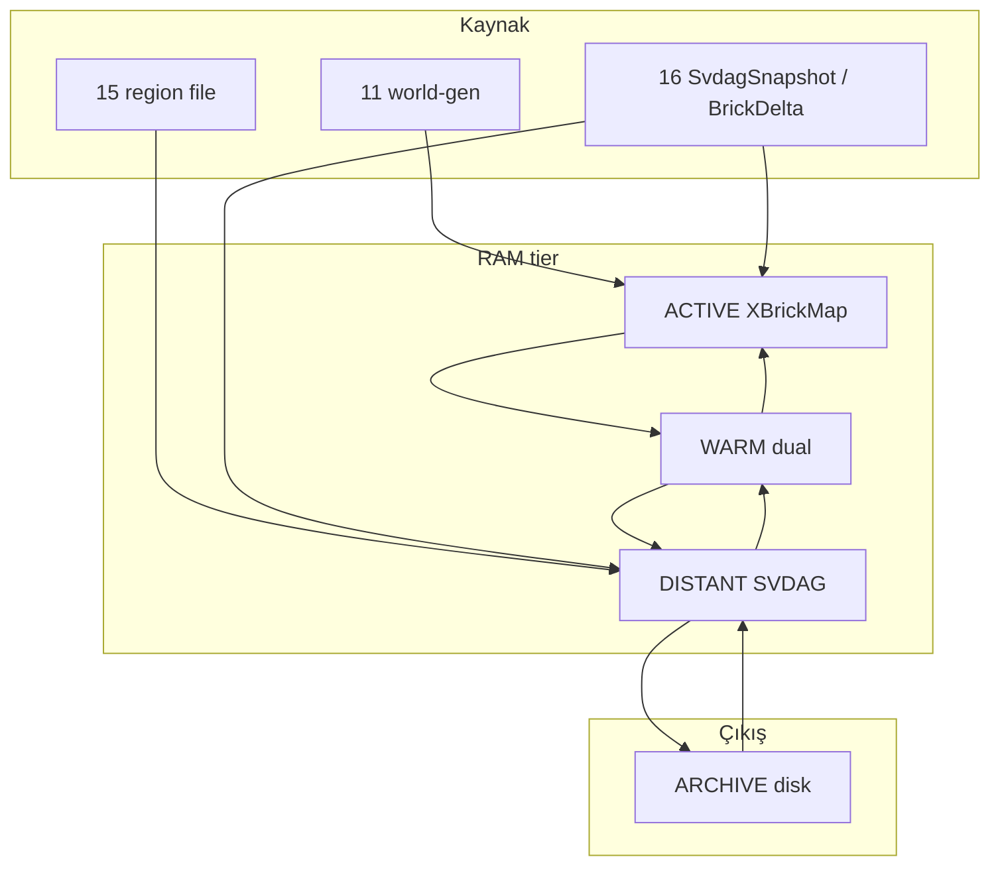

# 08 — 4-Tier Streaming Sistemi

> **Olgunluk:** 🔒 Kesinleşti (`01-overview.md` §1.1, 2026-06-05). Anayasa `01`–`10`; `01`–`07` ile çelişirse önce anayasa güncellenir veya `08` revize edilir. `16`+ taslaklarla çelişirse **bu dosya** esas alınır.
> **Crate:** `streaming` (`02-implementation.md` — `tier.rs`, `predictor.rs`, `priority.rs`)
> **Bağımlılıklar:** `06-xbrickmap.md` (32³ sektör, `GlobalBrickPool`, GPU feedback), `07-svdag.md` (bake/unbake, ghost page, shallow LOD), `03-ecs-architecture.md` (sector entity, `TierChange`, sistem sırası), `15-storage-and-persistence.md` (ARCHIVE), `16-network-and-lag-compensation.md` (AOI)
> **Harici doğrulama (2026-06):** [Aokana I3D 2025](https://arxiv.org/abs/2505.02017) (view-dependent LOD streaming, ~%5 VRAM), [GigaVoxels DP HPG 2024](https://hal.science/hal-04654692) (starvation-free geçiş), [Veloren](https://docs.veloren.net/veloren_server/chunk_generator.rs.html) (async chunk pipeline), Virtual Voxel / clipbox AOI literatürü

## 0. Kapsam ve sorumluluk sınırı

Bu dosya **orkestrasyon** planıdır: sektörlerin hangi **tier**’da olduğu, ne zaman yükleneceği/boşaltılacağı, öncelik kuyruğu ve frame/IO bütçesi.

| Konu | Dosya |
|------|--------|
| XBrickMap veri yapısı, pool, GPU feedback SSBO | `06` |
| SVDAG bake/unbake, ghost page WGSL, node pool | `07` |
| Greedy/GPU mesh | `09` |
| Visibility buffer, Hi-Z pass’leri | `10` |
| Region file, SQLite | `15` |
| AOI paketleri, delta sync | `16` |

**Strata farkı (Aokana vs):** Aokana saf render + edit yok; Strata **Tier 1–2’de XBrickMap edit** korur, uzakta **SVDAG** (`07`). Streaming, snapshot tabanlı bake zorunluluğunu tier geçişlerinde uygular (`06` §1.4, `07` §3).

---

## 1. Kademe tanımları

Sektör birimi: **32×32×32** kübik vokseller (`06`). Köşegen ≈ 55 m; politika mesafeleri **sektör merkezine** göre metre cinsinden (`§2`).

| Tier | Ad | Mesafe (m) | Veri formatı | Render | Fizik | Ghost (`07` §1.5) |
|------|-----|------------|--------------|--------|-------|-------------------|
| **1** | ACTIVE | &lt; 96 | XBrickMap (`GlobalBrickPool`) | Ray trace / greedy mesh (`09`) | Rapier Voxels tam | Opsiyonel ön-bake |
| **2** | WARM | 96 – 384 | XBrickMap + SVDAG (dual) | Brick öncelikli, SVDAG fallback | Rapier Voxels tam | `Loading` → `Ready` |
| **3** | DISTANT | 384 – 1536 | SVDAG only (brick pool serbest) | GPU SVDAG ray march (`10`) | Yaklaşık collider (`12`) | `Ready` |
| **4** | ARCHIVE | ≥ 1536 | Sıkıştırılmış SVDAG / region (`15`) | Yok | Yok | Stream-in yok |

**Yaklaşık hacim:** ACTIVE ≈ 3×3×3 sektör (~27); WARM halka; DISTANT daha geniş küre — kesin hacim `§4` LODError + bütçe ile sınırlanır (sabit küp zorunlu değil).

---

## 2. Tier belirleme ve hysteresis

### 2.1 `SectorCoord` (32³ kübik — `06` ile aynı)

```rust
pub const SECTOR_SIZE: i32 = 32;

#[derive(Hash, PartialEq, Eq, Clone, Copy, Debug)]
pub struct SectorCoord(pub IVec3);

impl SectorCoord {
    pub fn from_world_voxel(pos: IVec3) -> Self {
        Self(pos.div_euclid(SECTOR_SIZE))
    }

    pub fn world_origin_voxel(&self) -> IVec3 {
        self.0 * SECTOR_SIZE
    }

    /// Merkez — tier mesafesi için (metre).
    pub fn world_center(&self) -> Vec3 {
        self.world_origin_voxel().as_vec3() + Vec3::splat(SECTOR_SIZE as f32 * 0.5)
    }
}
```

> **Not:** Eski taslaktaki `y.div_euclid(128)` **kaldırıldı** — dikey sınır yok (`06` cubic chunks).

### 2.2 Mesafe tabanlı tier

```rust
#[derive(Clone, Copy, PartialEq, Eq, Debug)]
pub enum Tier {
    Active,
    Warm,
    Distant,
    Archive,
}

pub struct TierThresholds {
    pub active_m: f32,   // default 96.0
    pub warm_m: f32,     // default 384.0
    pub distant_m: f32,  // default 1536.0
}

pub fn determine_tier(distance_m: f32, t: &TierThresholds) -> Tier {
    if distance_m < t.active_m {
        Tier::Active
    } else if distance_m < t.warm_m {
        Tier::Warm
    } else if distance_m < t.distant_m {
        Tier::Distant
    } else {
        Tier::Archive
    }
}

pub fn sector_distance_m(coord: SectorCoord, observer: Vec3) -> f32 {
    (coord.world_center() - observer).length()
}
```

### 2.3 Tier hysteresis (titreme önleme)

`16-network` §3.2 ile aynı mantık — tier sınırında hızlı Active↔Warm flip'i engeller:

```rust
pub struct TierHysteresis {
    pub enter_extra_m: f32,  // default 16.0 — tier'a *giriş* daha geç
    pub exit_extra_m: f32,     // default 0.0  — tier'dan *çıkış* nominal eşik
}

/// `current_tier` None ise ilk atama — hysteresis yok.
pub fn determine_tier_hysteresis(
    distance_m: f32,
    current_tier: Option<Tier>,
    t: &TierThresholds,
    h: &TierHysteresis,
) -> Tier {
    let raw = determine_tier(distance_m, t);
    let Some(cur) = current_tier else {
        return raw;
    };
    if raw == cur {
        return cur;
    }
    // Non-adjacent tier geçişleri (örn: Active→Distant, teleport/elytra):
    // hysteresis uygulanmaz, raw tier kullanılır.
    // Mantık: ara tier'ları atlayan hızlı hareket zaten sınır titremesi
    // yaratmaz; hysteresis sadece komşu tier flip'ini bastırır.
    match (cur, raw) {
        (Tier::Active, Tier::Warm) if distance_m < t.active_m + h.exit_extra_m => Tier::Active,
        (Tier::Warm, Tier::Active) if distance_m > t.active_m - h.enter_extra_m => Tier::Warm,
        (Tier::Warm, Tier::Distant) if distance_m < t.warm_m + h.exit_extra_m => Tier::Warm,
        (Tier::Distant, Tier::Warm) if distance_m > t.warm_m - h.enter_extra_m => Tier::Distant,
        (Tier::Distant, Tier::Archive) if distance_m < t.distant_m + h.exit_extra_m => Tier::Distant,
        (Tier::Archive, Tier::Distant) if distance_m > t.distant_m - h.enter_extra_m => Tier::Archive,
        _ => raw, // non-adjacent veya hysteresis dışı → raw tier
    }
}
```

### 2.4 View-dependent LOD tamamlayıcısı (Aokana / Virtual Voxel)

Sabit metre eşikleri **üst politika**; ince ayar için Aokana §3.4 LODError (opsiyonel, `07` `LodSectorSvdag`):

\[
\text{LODError} = (\text{ChunkSize} \times \text{StreamingFactor}) - \|\text{ChunkCenter} - \text{Observer}\|
\]

- `LODError > 0` → daha ince LOD gerekir (alt sektörlere in veya ACTIVE’e yaklaş).
- `LODError ≤ 0` → mevcut LOD yeterli; yükleme adayı.

`StreamingFactor` default `2.0` (Aokana Greenfield testi). `ChunkSize` = sektör kenarı × \(2^{lod}\) (metre). Bu, geniş FOV / yüksek çözünürlükte gereksiz DISTANT yükünü azaltır.

**Yükleme sırası (Aokana):** Önce **yüksek LOD (kaba)** aggregate SVDAG, VRAM’de yer açılınca yakın **LOD-0** + XBrickMap — pop-in ve “streaming acne” (küçük eksik parçalar) riskini düşürür.

---

## 3. Yumuşak geçiş (dual representation)

Tier 2 (**WARM**) her iki temsili tutar; pop-in yok. Mekanik detay `07` §1.5 ghost page + §3 bake/unbake; burada **ne zaman** tetiklenir.

### 3.1 Uzaklaşma

| Geçiş | Adımlar | ECS (`07` §1.9) |
|--------|---------|------------------|
| **1 → 2** | Brick aktif (render+fizik); arka planda snapshot’tan bake | `insert(NeedsSvdagBake)` |
| **2 → 3** | Bake hazır → brick pool serbest; SVDAG tek kaynak; yaklaşık collider | `pool_anchor = None`; ghost `Ready` |
| **3 → 4** | SVDAG sıkıştır → disk (`15`); RAM’den düş | `SectorUnloaded` event |
| **2 → 1** | SVDAG root drop + epoch++ (`07` GC); devam eden bake varsa **iptal** (partial node'lar deferred free list'e, bir sonraki epoch'ta temizlenir — `07` §1.1 cascading-free kuralı) | `remove NeedsSvdagBake` |

### 3.2 Yaklaşma

| Geçiş | Adımlar | ECS |
|--------|---------|-----|
| **3 → 2** | Unbake kuyruğu (GPU wavefront, ~2.8 ms yayılı — `07`) | `insert(NeedsSvdagUnbake)` |
| **2 → 1** | Unbake commit → `ChunkDirty`, `NeedsRemesh`; SVDAG opsiyonel kalabilir | `07` §3.8 akışı |
| **4 → 3** | Disk’ten SVDAG stream-in; ghost `Loading` | `SectorLoaded` |

### 3.3 Render önceliği (WARM)

1. XBrickMap / mesh — tam çözünürlük, edit path.
2. SVDAG — brick miss veya ghost `Ready` fallback (`07` WGSL `select`).
3. Ghost `Loading` — brick-only; starvation yok (GigaVoxels DP ilkesi).

### 3.4 Kaba→ince bağımlılığı

DISTANT→WARM unbake başlamadan önce ilgili **aggregate LOD** (varsa) `Ready` olmalı. WARM→ACTIVE’te brick render en az bir kare doğrulandıktan sonra SVDAG düşürülür (pulse unload/load filtresi — `§5.4`).

### 3.5 Tam geçiş tablosu (ZST tetikleyiciler)

`tier_transition_system` (`07`) bu tabloyu uygular; eksik çiftler `TierChange` only:

| old → new | ZST / aksiyon |
|-----------|----------------|
| Active → Warm | `NeedsSvdagBake` |
| Warm → Distant | brick free (CollectBake tamam varsayımı) |
| Distant → Warm | `NeedsSvdagUnbake` |
| Warm → Active | SVDAG drop, epoch++; devam eden bake iptal → deferred free (`07` §1.1) |
| * → Archive | flush dirty, unload RAM |
| Archive → Distant | disk load queue |
| **Non-adjacent** (örn: Active → Distant) | Hysteresis atlanır (`§2.3`); tüm ara tier aksiyonları sırayla uygulanır: önce brick free → sonra SVDAG-only. Tek frame'de çoklu geçiş olarak işlenir. |

---

## 4. StreamingManager ve resident set

### 4.1 Resource

```rust
#[derive(Resource)]
pub struct StreamingManager {
    pub thresholds: TierThresholds,
    pub hysteresis: TierHysteresis,
    pub frame_budget: FrameBudget,
    pub anchors: Vec<StreamingAnchor>,
    pub load_queue: BinaryHeap<StreamRequest>,  // max-heap by priority
    pub pending_unload: HashMap<SectorCoord, Instant>, // unload delay
    pub pulse_filter: PulseFilter,
}

#[derive(Clone)]
pub struct StreamingAnchor {
    pub observer: Vec3,
    pub velocity: Vec3,
    pub look_direction: Vec3,
    pub weight: f32,           // default 1.0 — çoklu viewer
    pub enable_prefetch: bool,
}

pub struct FrameBudget {
    pub max_loads_per_frame: u32,    // default 2
    pub max_unloads_per_frame: u32,  // default 1
    pub max_bake_enqueue_per_frame: u32, // default 1
    pub unload_delay_ms: u64,        // default 3000
    pub max_streaming_ms_per_frame: f32, // default 1.0
}
```

`07` `SvdagStreamingManager` — VRAM resident set (%5), LRU node eviction, 200 MB/s hedefi; `StreamingManager` tier + kuyruk sahibi, SVDAG tarafına delegate eder.

**Delegation protokolü (tek authoritative kuyruk):**

`StreamingManager` tier kararı ve öncelik skorunu üretir; VRAM bütçesi ve node yönetimi `SvdagStreamingManager` (`07` §1.6) üzerindedir. Çift kuyruk (double-pop / starvation) riskini önlemek için:

```rust
// streaming_process_loads içinde — her frame budget kadar:
for request in self.load_queue.drain(..budget) {
    // Tier kararını SVDAG tarafına ilet; tek kuyruk SvdagStreamingManager'da.
    svdag_streaming.enqueue(
        request.coord,
        request.priority,
        request.target_lod, // 07 §1.6 select_lod ile eşleşir
    );
}
// SvdagStreamingManager kendi içinde VRAM budget + LRU eviction uygular.
// StreamingManager sadece tier politika + frame budget cap sahibi.
```

**Kural:** `StreamingManager.load_queue` politika kuyruğu (tier + öncelik); `SvdagStreamingManager.load_queue` icra kuyruğu (VRAM + streaming). Pop yalnızca icra kuyruğundan yapılır.

### 4.2 Performans hedefleri

| Metrik | Hedef | Kaynak |
|--------|-------|--------|
| VRAM’de aktif sahne oranı | ≤ **%5** | Aokana |
| Stream throughput | **200 MB/s** | Aokana / PCIe |
| Prefetch hit rate | ≥ **%95** | Aokana |
| Streaming CPU overhead | **&lt; 1 ms/frame** | `07` §1.6 |
| SVDAG↔brick geçiş starvation | **0 ms** (ghost) | GigaVoxels DP |

---

## 5. Öncelik kuyruğu (hibrit talep + tahmin)

### 5.1 Skor bileşenleri

```rust
pub fn stream_priority(
    coord: SectorCoord,
    anchor: &StreamingAnchor,
    gpu_feedback: &GpuSectorFeedback,  // 06 §2.6
    tier_target: Tier,
    transition_cost: f32,
) -> f32 {
    let to = (coord.world_center() - anchor.observer).normalize_or_zero();
    let dist = sector_distance_m(coord, anchor.observer);

    let w_gpu = 2.0;
    let w_vis = 1.5;
    let w_vel = 1.0;
    let w_look = 0.8;
    let w_dist = 0.5;
    let w_cost = 1.2;

    let gpu = if gpu_feedback.was_visible(coord) { 1.0 } else { 0.0 };
    let vel_align = to.dot(anchor.velocity.normalize_or_zero()).max(0.0);
    let look_align = to.dot(anchor.look_direction).max(0.0);
    let dist_score = 1.0 / (1.0 + dist / 96.0);

    w_gpu * gpu
        + w_vel * vel_align
        + w_look * look_align
        + w_dist * dist_score
        - w_cost * transition_cost
}
```

`transition_cost`: Active=0, Warm bake=0.6, Unbake=0.8, Disk IO=0.4 (normalize).

### 5.2 Öncelik katmanları

| Katman | Koşul | Örnek |
|--------|-------|-------|
| **Immediate** | Ayak altı sektör, tier Active | Oyuncu voxel edit |
| **High** | GPU feedback bu kare + tier ≤ Warm | `06` SSBO |
| **Normal** | Frustum içi, mesafe &lt; warm | `10` culling |
| **Prefetch** | `enable_prefetch` + hız &gt; eşik, koniye hizalı | `§6` |
| **Low** | DISTANT halka, disk ARCHIVE | Arka plan |

### 5.3 GPU feedback entegrasyonu (`06`)

Her kare sonu:

1. Compute pass `atomicMax` / `atomicAdd` ile sector ID SSBO (`06` §2.6).
2. CPU `readback` (üçlü buffer — upload stall önleme).
3. Feedback’teki sektörler `load_queue`’ya **High** öncelik.

Bu, “tüm komşuları yükle” yerine **gerçekten çizilen** sektörleri öne alır — PCIe ve bake tasarrufu.

### 5.4 Pulse filtresi

Kısa süreli unload→reload (tier sınırı titremesi) bastırılır.

**Etkileşim: `unload_delay_ms` vs `PulseFilter`:**
- `unload_delay_ms` (3000 ms): Sektörün RAM'den **düşmesini** geciktirir. Tier düşüşü anında sektöre geri dönülürse reload gerekmez.
- `PulseFilter` (30 frame ≈ 0.5 s): Sektör RAM'den **düştükten sonra** hızlı reload'u engeller. `unload_delay` dolup sektör gerçekten serbest bırakıldıktan sonra devreye girer.

```
Zaman çizelgesi:
  t=0   : tier düşüşü → pending_unload başlar
  t=3s  : unload_delay dolar → sektör RAM'den düşer, pulse_filter kaydı başlar
  t=3.5s: pulse_filter dolar → sektör yeniden yüklenebilir
```

```rust
pub struct PulseFilter {
    pub min_dwell_frames: u32,  // default 30 (~0.5s @60Hz)
}

/// Sektör `min_dwell_frames` içinde unload edildi ve filter süresi dolmadıysa reload ertelenir.
```

---

## 6. Predictive streaming

### 6.1 Tahmin konumu

```rust
pub struct StreamingPredictor {
    pub horizon_s: f32,  // default 2.0
}

impl StreamingPredictor {
    pub fn predict_position(&self, current: Vec3, vel: Vec3, accel: Vec3) -> Vec3 {
        let t = self.horizon_s;
        current + vel * t + accel * (0.5 * t * t)
    }
}
```

### 6.2 Prefetch konisi

- `|velocity| < 2 m/s` → prefetch kapalı (yerinde dönme).
- Aksi halde: tahmin merkezli `prefetch_radius` (default 2 sektör) + bakış yönü yarımküre (`dot(to_sector, look) > 0.3`).

### 6.3 Çoklu anchor

| Anchor | `weight` | Prefetch |
|--------|----------|----------|
| Yerel kamera (client) | 1.0 | Evet |
| Uzak oyuncu (server sim) | 0.5 | Hayır |
| Collision-only probe | 0.3 | Hayır |

Godot Voxel Tools **CLIPBOX** ilkesi: çoklu viewer için kutu tabanlı yükleme (`16` AOI kutuları ile hizalı).

### 6.4 Spiral outward (yeni alan)

Sunucu / ilk giriş: oyuncu merkezinden **spiral** sektör sırası (VoxyServer benzeri) — rastgele HashMap iteration yerine öngörülebilir IO.

---

## 7. Sector yaşam döngüsü



### 7.1 Spawn

1. `ChunkMap`’te entity yok → `SectorLoaded` talebi.
2. Kaynak: sunucu authoritative (`17`); client disk cache (`15`).
3. `SectorEntity` + `SectorData(Arc<CompressedChunkData>)` + tier `Active` veya mesafeye göre.

### 7.2 Boşaltma

1. `pending_unload` + `unload_delay_ms` dolunca işle.
2. Dirty ise snapshot + region yaz (`15`) — ACTIVE/WARM edit path.
3. `GlobalBrickPool` slot free, `SectorSvdag` epoch (`07`).
4. `commands.entity despawn` veya ARCHIVE stub component.

### 7.3 İptal

Veloren `ChunkGenerator::cancel_if_pending` modeli: anchor yön değişince bekleyen bake/disk IO **iptal** (`AtomicBool` flag).

---

## 8. Frame ve IO disiplini

| Kural | Değer | Amaç |
|-------|-------|------|
| `max_loads_per_frame` | 2 | Ana thread stutter yok |
| `max_unloads_per_frame` | 1 | GC spike yayma |
| `unload_delay_ms` | 3000 | Geri dönüşte reload fırtınası |
| Bake/unbake | SlowJob / GPU async | `07` kuyruk |
| Disk | `spawn_blocking` / tokio | `15` |

**Ana thread’de:** yalnızca kuyruk pop + component insert/remove; ağır iş worker’da.

---

## 9. ECS entegrasyonu (`03`)

### 9.1 İlgili component'lar

- `SectorEntity { coord, tier }` — **spawn anında** initial değer; `tier` alanı immutable kabul edilir (SOA hot/cold ayrımı: `03` §2.A.2).
- `SectorTransform.tier` — **authoritative tier kaynağı** (`07` §1.9). `tier_transition_system` yalnızca bu alanı günceller; diğer tüm sistemler tier bilgisini `SectorTransform`'tan okur. Bu, Bevy change-detection guard kuralı (`03` §2.A.3) ile uyumludur: `SectorEntity.tier` değişmediği için spurious `Changed<SectorEntity>` tetiklenmez.
- `TierChange` — SparseSet, geçiş anı.
- `SectorTransition` — ghost + pool anchor (`07` §1.5).
- ZST: `NeedsSvdagBake`, `NeedsSvdagUnbake`, `ChunkDirty`, `NeedsRemesh` (`03`).

### 9.2 Sistem sırası

```
WorldSystems::Streaming
  → streaming_collect_feedback      // 06 readback
  → streaming_update_anchors        // velocity, predict
  → streaming_priority_enqueue      // load_queue
  → tier_transition_system            // 07 — TierChange + ZST
  → streaming_process_loads         // budget cap
  → streaming_process_unloads       // delay + budget
  → SvdagSystems::EnqueueBake / CollectBake / …  // 07
```

`world_streaming_system` (`03` §6.2) bu zincire **birleştirilir**; mesafe `sector_distance_m` + hysteresis kullanır.

### 9.3 Olaylar

```rust
pub enum StreamingEvent {
    SectorLoaded { coord: SectorCoord, source: LoadSource },
    SectorUnloaded { coord: SectorCoord },
    TierPromoted { coord: SectorCoord, from: Tier, to: Tier },
    TierDemoted { coord: SectorCoord, from: Tier, to: Tier },
}

pub enum LoadSource {
    WorldGen,
    Disk,
    Network,
}
```

**Event consumer'lar (Bevy `EventReader<StreamingEvent>`):**

| Event | Tüketici sistem | Aksiyon |
|-------|-----------------|----------|
| `SectorUnloaded` | `12-physics` `PhysicsSystems::Update` | Collider cleanup: Rapier voxel collider'ı serbest bırak |
| `SectorUnloaded` | `13-lighting` `LightingSystems::Update` | LightMap texture_3d free; propagated light dirty flag |
| `SectorUnloaded` | `16-network` `NetworkSystems::Send` | AOI subscription kaldır; peer'lara unload bildir |
| `SectorLoaded` | `13-lighting` `LightingSystems::Bake` | Skylight propagation başlat (wavefront BFS, `06` §1.1) |
| `SectorLoaded` | `12-physics` `PhysicsSystems::Update` | Collider oluştur (tier'a göre full/approx — `§12`) |
| `TierPromoted/Demoted` | `16-network` `NetworkSystems::Sync` | AOI sync Hz değiştir (`§10` tablosu); kanal switch |

---

## 10. Multiplayer ve AOI (`16`)

Streaming yarıçapları = AOI politikası (tek tablo):

| Tier | AOI (sektör küpü) | Sync Hz | Kanal |
|------|-------------------|---------|-------|
| ACTIVE | 3×3×3 ≈ 27 | 20 | `BrickDelta` |
| WARM | 5×5×5 ≈ 125 | 10 | `SvdagSnapshot` |
| DISTANT | 7×7×7 ≈ 343 | 2–5 | minimal metadata |
| ARCHIVE | — | — | client gen / disk |

**Rate limit (sunucu):** `max_sectors_per_tick_per_player` (default 10), `tick_interval` (default 5 tick) — VoxyServer tarzı burst kontrolü.

**Hysteresis:** `§2.3` + `16` §3.2 (`enter_extra_m = 16`).

---

## 11. ARCHIVE ve depolama (`15`)

- Tier 4: yalnızca sıkıştırılmış payload; render/fizik yok.
- Dirty flush: unload anında veya periyodik batch (`15` region).
- Stream-in: öncelik **Low**; DISTANT ghost ile uyumlu.
- Dedup hash (`15` xxhash) — aynı geometri ARCHIVE’de tek payload.

---

## 12. Çapraz sistem sözleşmeleri

| Sistem | Tier ACTIVE | WARM | DISTANT | ARCHIVE |
|--------|-------------|------|---------|---------|
| **09 meshing** | `NeedsRemesh` | Evet | Hayır | — |
| **10 render** | XBrick trace | + SVDAG fallback | SVDAG march | — |
| **12 physics** | Rapier full | Rapier full | Approx | — |
| **13 lighting** | L0–L3 | L0–L3 + L4 uzak | L4 cone | — |
| **06 upload** | Page table nokta atışı | Aynı | — | — |

---

## 13. Test ve kabul kriterleri

- [ ] Tier sınırında 60 s uçuş: pop-in yok (WARM dual + ghost).
- [ ] Hızlı 180° dönüş: iptal edilen bake kuyruğu bellek sızıntısı yok.
- [ ] GPU feedback: görünür sektör &lt; 2 kare içinde High öncelikle yüklenir.
- [ ] `unload_delay` içinde geri dönüş: sektör hâlâ RAM’de veya &lt; 1 kare disk reload.
- [ ] VRAM resident ≤ %5 hedef (profil, `33`).
- [ ] Multiplayer: iki client farklı tier’da aynı sektör — sunucu truth, AOI hysteresis.

---

## 14. Crate modülleri (`02`)

```
streaming/
  mod.rs           — StreamingPlugin, StreamingManager
  tier.rs          — determine_tier, hysteresis, thresholds
  predictor.rs     — predict_position, prefetch cone
  priority.rs      — stream_priority, load_queue, pulse_filter
  lifecycle.rs     — load/unload, cancel, events
```

---

## 15. Reddedilen alternatifler

| Alternatif | Neden red |
|------------|-----------|
| Tek derin SVDAG + streaming | VRAM ve cache miss (`07`) |
| GigaVoxels DP tam kopya | Şeffaf brick varsayımı; Strata opak + SVDAG (`07` §1.5) |
| Sabit 3³/5³/7³ her çözünürlükte | FOV’dan bağımsız verimsiz |
| Ana thread sync bake + disk | Frame chop |
| `HashMap<Sector>` monolit dünya | `03` ECS entity + `ChunkMap` |

---

## 16. Referanslar

- Fang et al., *Aokana: A GPU-Driven Voxel Rendering Framework for Open World Games*, I3D 2025 — [arxiv:2505.02017](https://arxiv.org/abs/2505.02017)
- Richermoz & Neyret, *GigaVoxels DP*, HPG 2024 — [HAL](https://hal.science/hal-04654692)
- Yang & Campbell, *Virtual Voxel* (LODError formülü) — Aokana §3.4 atıf
- Veloren `ChunkGenerator` — async generate + cancel
- Strata anayasa: `06`, `07`, `03`, `16`, `15`

---

## 17. Araştırma Doğrulamaları ve Öneriler (2026-06)

> **Kaynak:** 5 worker ile 40+ WebSearch sorgusu, Aokana/GigaVoxels akademik literatürü, voxel motor karşılaştırmaları.

### 17.1 Doğrulanan Kararlar

| Karar | Doğrulama |
|-------|-----------|
| 4-tier streaming | Aokana + GigaVoxels validated |
| Dual representation (WARM) | Ghost page starvation-free approach ile uyumlu |
| TierHysteresis | Komşu tier flip'i bastırma — production validated |
| GPU feedback SSBO öncelik | Görünür sektörler High öncelik, PCIe bandwidth optimizasyonu |

### 17.2 P1 — LODError Zorunlu Statüsü Değişikliği

**Problem:** Plan §2.4'te LODError "opsiyonel" olarak işaretli. Ancak Aokana implicit octree traversal FOV/çözünürlük adaptasyonu için **production'da zorunlu**.

**Değişiklik:** §2.4'teki "opsiyonel" ifadesi "zorunlu" olarak güncellenmeli.

**Gerekçe:**
- Sabit metre eşikleri FOV/çözünürlükten bağımsız → ultra-wide monitörde gereksiz DISTANT yükleme
- LODError, StreamingFactor ile dinamik ayar → donanım adaptasyonu
- Aokana Greenfield testi: StreamingFactor=2.0 ile optimal denge

```rust
// §2.4 güncelleme: "opsiyonel" → "zorunlu"
// LODError artık üst politika ile birlikte ZORUNLU çalışır
pub fn determine_tier_with_lod_error(
    distance_m: f32,
    lod_error: f32,
    current_tier: Option<Tier>,
    t: &TierThresholds,
    h: &TierHysteresis,
) -> Tier {
    let base_tier = determine_tier_hysteresis(distance_m, current_tier, t, h);
    // LODError > 0 → daha ince LOD gerekir (alt sektörlere in veya ACTIVE'e yaklaş)
    if lod_error > 0.0 && base_tier == Tier::Distant {
        return Tier::Warm; // DISTANT → WARM (daha ince LOD)
    }
    base_tier
}
```

### 17.3 P1 — SSE Bazlı LOD Hesaplaması

**Problem:** Mevcut LOD seçimi sadece mesafe bazlı. Oysa ekran çözünürlüğü ve FOV da LOD kalitesini etkiler.

**Çözüm:** Screen-Space Error (SSE) bazlı LOD — LODError metre-cinsinden SSE piksel-cinsinden dönüşüm.

```rust
/// SSE bazlı LOD seçimi — FOV/DPI adaptif
pub fn compute_sse(
    chunk_size: f32,           // sektör kenarı (metre)
    distance: f32,             // kamera mesafesi (metre)
    fov_y: f32,                // dikey FOV (radyan)
    screen_height: u32,        // ekran yüksekliği (piksel)
) -> f32 {
    let pixel_size = 2.0 * distance * (fov_y / 2.0).tan() / screen_height as f32;
    chunk_size / pixel_size // SSE: chunk'ın piksel cinsinden boyutu
}

/// SSE eşiklerine göre tier override
pub fn sse_tier_override(sse: f32, base_tier: Tier) -> Tier {
    if sse < 2.0 {
        Tier::Archive // Piksel boyutu < 2 → görünmez, arşivle
    } else if sse < 8.0 {
        Tier::Distant // Piksel boyutu < 8 → düşük detay yeterli
    } else {
        base_tier // SSE yeterli → normal tier
    }
}
```

**Avantaj:** 4K monitörde daha yakın DISTANT yükleme, 1080p'de daha agresif arşivleme.

### 17.4 P2 — Chebyshev Mesafe (Hızlı Tier Hesaplama)

**Problem:** Euclidean mesafe hesaplama (`Vec3::length()`) sqrt içerir — her sektör için ~10ns.

**Çözüm:** Chebyshev mesafesi (max axis distance) — sqrt yok, ~2-3× hızlı.

```rust
// Euclidean (mevcut):
let dist = (coord.world_center() - observer).length(); // sqrt

// Chebyshev (alternatif):
let diff = coord.world_center() - observer;
let dist = diff.x.abs().max(diff.y.abs()).max(diff.z.abs()); // sqrt yok
```

**Tradeoff:** Chebyshev küresel tier sınırları yerine küp sınırlar kullanır. Strata'nın 32³ kübik sektörleriyle uyumlu olabilir, ama küresel boundary daha doğal.

**Değerlendirme:** StreamingManager'da fast-path olarak — tier hesaplama hot path'te (~1000 call/frame) sqrt eliminasyonu measurable etki yaratır.

### 17.5 P1 — PulseFilter Over-Engineering Uyarısı

**Problem:** Mevcut PulseFilter tasarımı aşırı karmaşık olabilir.

**Öneri:** `enter_extra_m` + `unload_delay_ms` ikisi çoğu senaryo için yeterli. PulseFilter profiling sonrası gerekirse eklenmeli — Phase 1'de implementasyon gereksiz.

**Strateji:**
1. Phase 1: Basit hysteresis (`enter_extra_m=16`)
2. Phase 2: Profiling yap, titreme varsa PulseFilter ekle
3. Premature optimization riski: PulseFilter karmaşıklığı debug maliyetini artırır
